### create new app

### masukkan nama app dan nama pipline

### hubungkan dengan akun github

### cari repo github yang akan di deploy
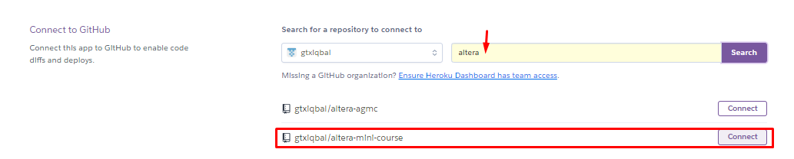
### pada tab setting, lakukan konfigurasi environtment variable
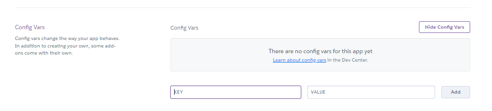
### aktifkan auto deploy dan klik deploy branch
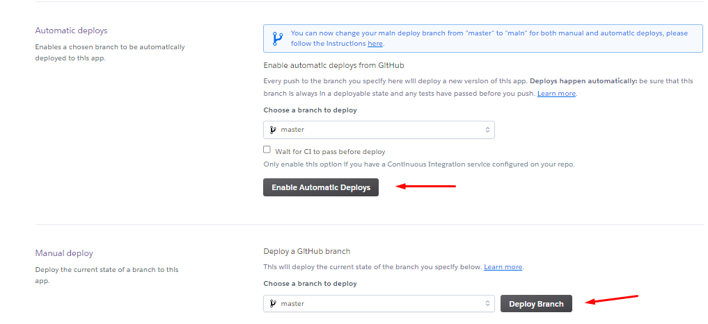
### tunggu hingga proses build & deploy selesai
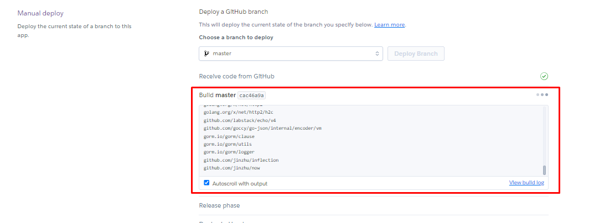
### deploy sudah berhasil
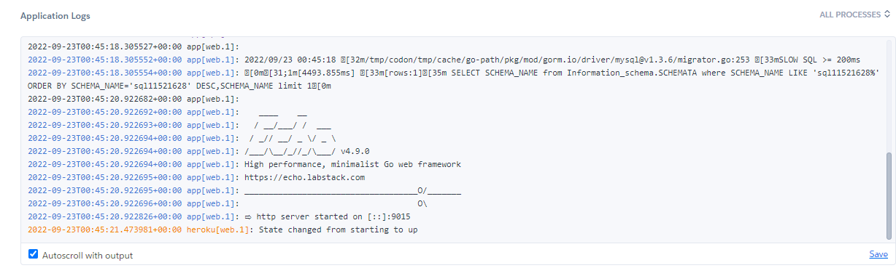
### menambah users baru
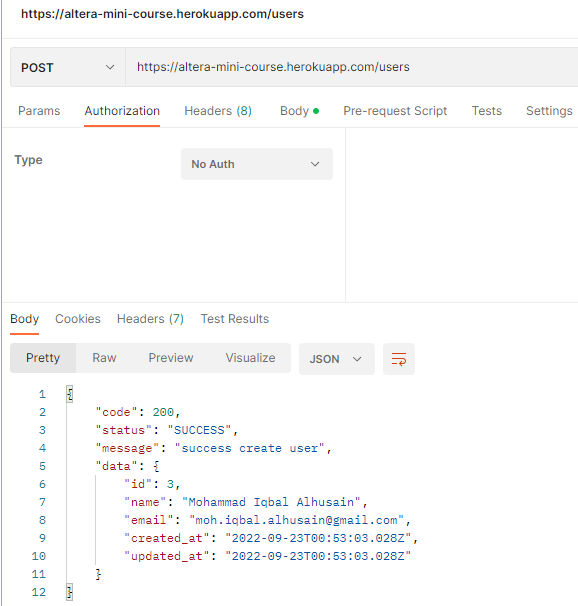
### login untuk mendapatkan access token
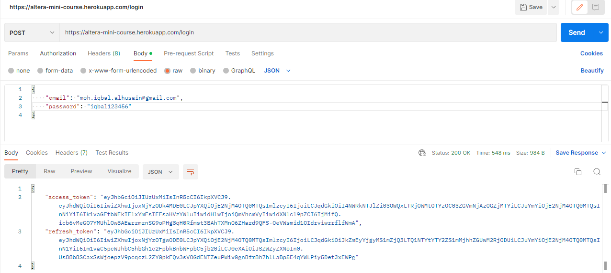
### masukkan token pada authorization bear token
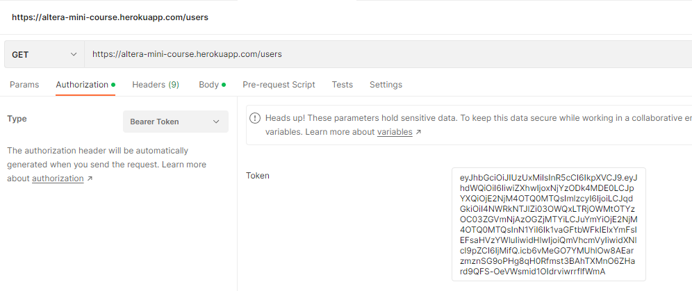
### get all user
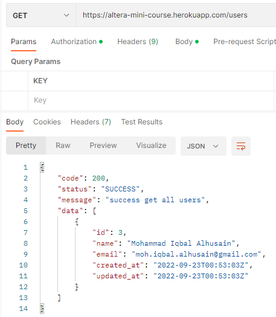
### get user by id
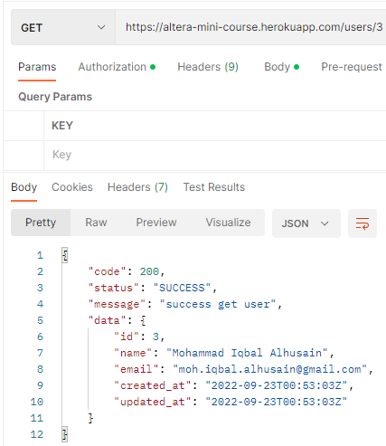
### update data user by id
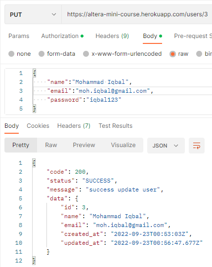
### delete data user by id
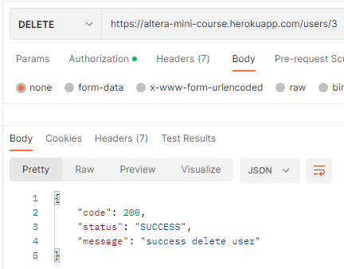
### add new book
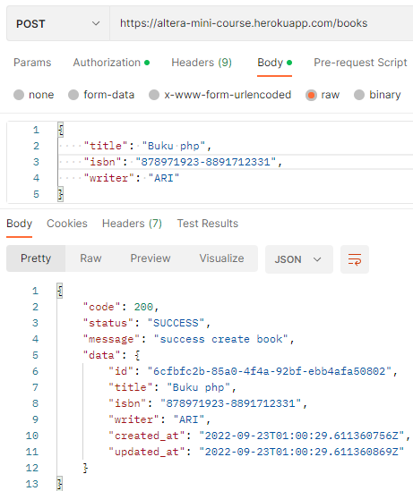
### get all book
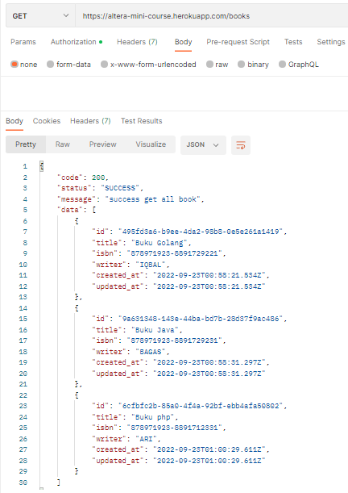
### get book by id
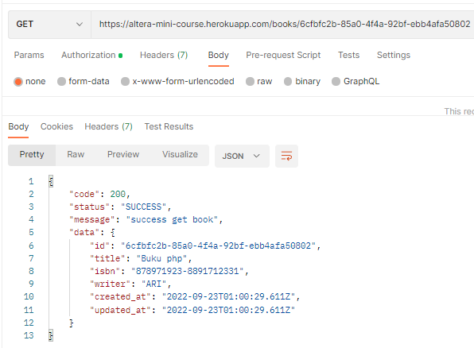
### update book by id
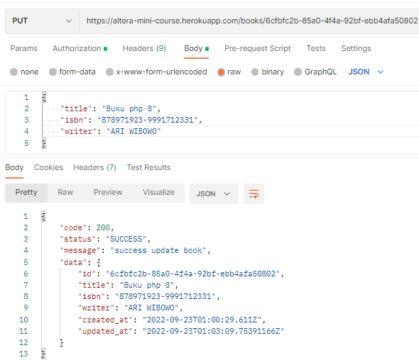
### delete book by id
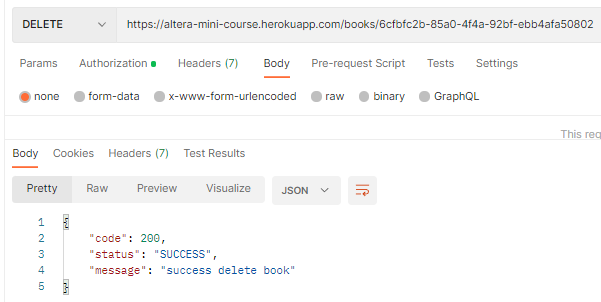